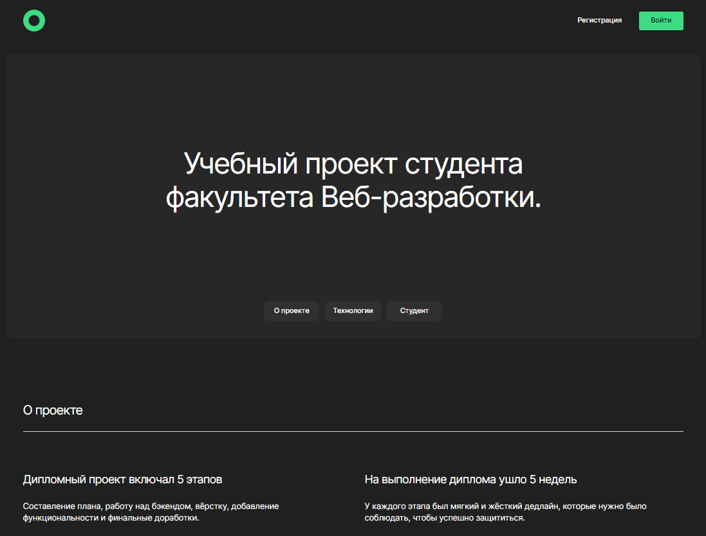

# movies-explorer-frontend

## Описание проекта:
Репозиторий для приложения проекта `Online Cinema`, включающий фронтенд часть приложения, в котором реализовано:
- поиск фильмов через запрос с сервиса beatfilm-movies.
- сохранение фильмов в личном кабинете пользователя и их удаление из личного кабинета.

## Технологии и функциональность Frontend:
* HTML
* CSS
* Разметка портирована в JSX.
* Flexbox
* JS
* Node.js
* React, CRA.
* Адаптивная верстка для разрешений от 320 до 1280 пикселей.
* BEM Nested
* Использован API Яндекс.Практикум.
* Использован Backend Яндекс.Практикум.
* Реализованы модальные окна добавления новой фотографии, изменения данных автора страницы, изменения аватара автора.
* Реализовано модальное окно просмотра фотографии.
* Реализовано добавления Лайка для фотографии, счетчик Лайков.
* Реализовано удаление фотографии.
* Настроен роутинг между страницами, в т.ч. защищенный авторизацией.
* Реализована регистрация и авторизация нового пользователя.
* Реализован личный кабинет пользователя.
* Реализована работа с локальным хранилищем и токеном.

## Команды для запуска проекта
`npm run start` — запускает сервер

## Адрес репозитория:
https://github.com/kpolllka/movies-explorer-frontend   
https://github.com/kpolllka/movies-explorer-api - backend часть приложения